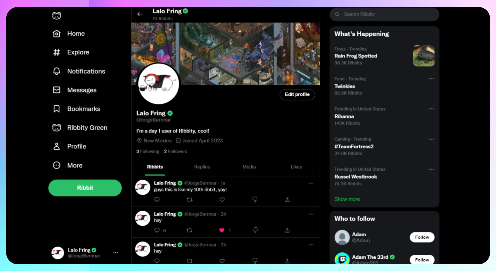
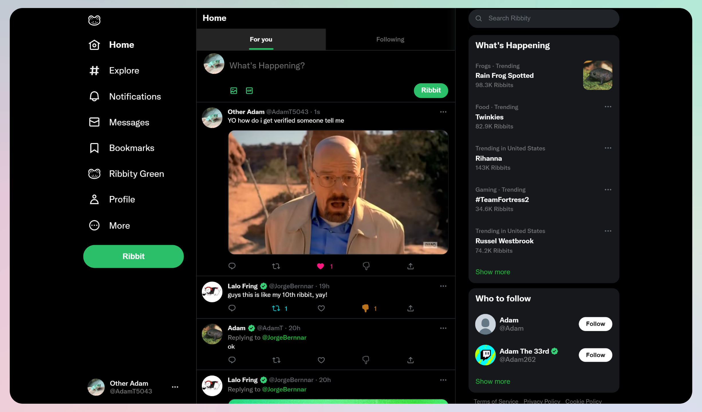
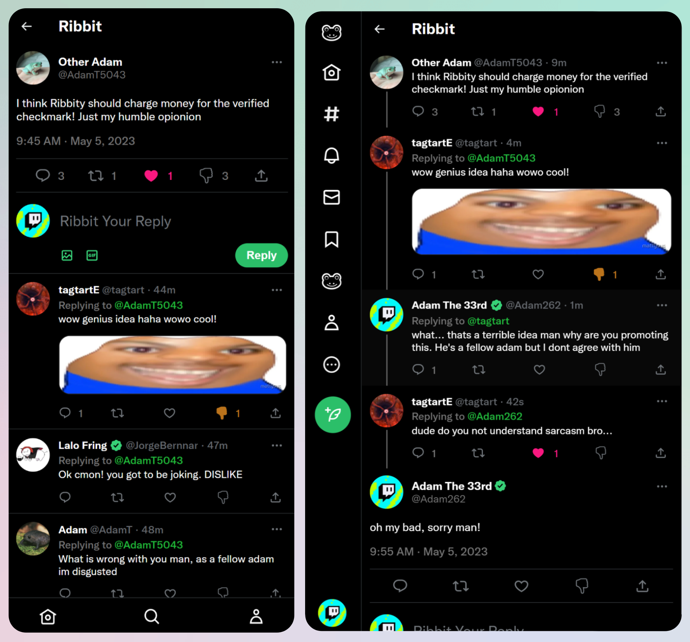
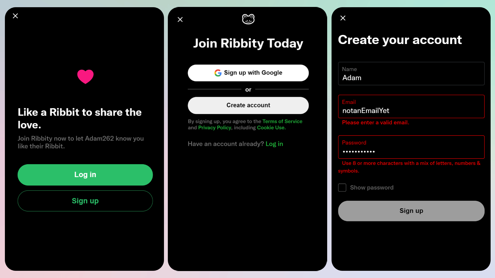
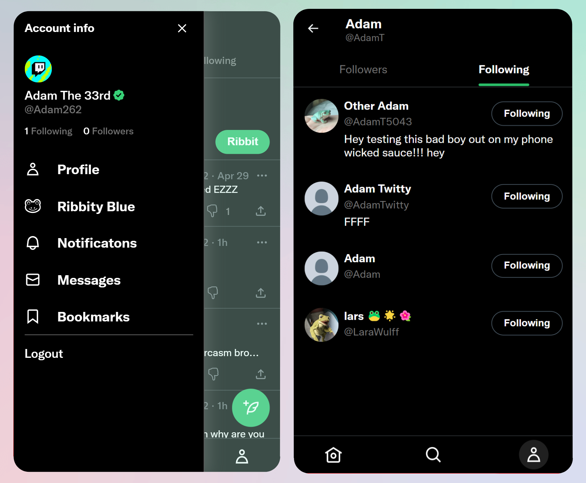
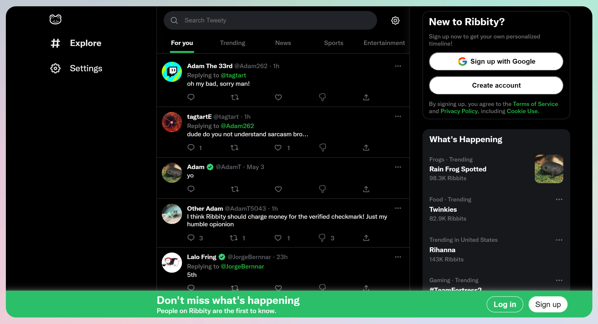
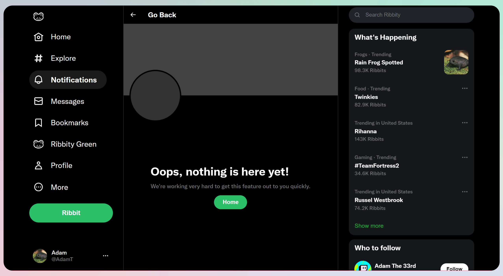
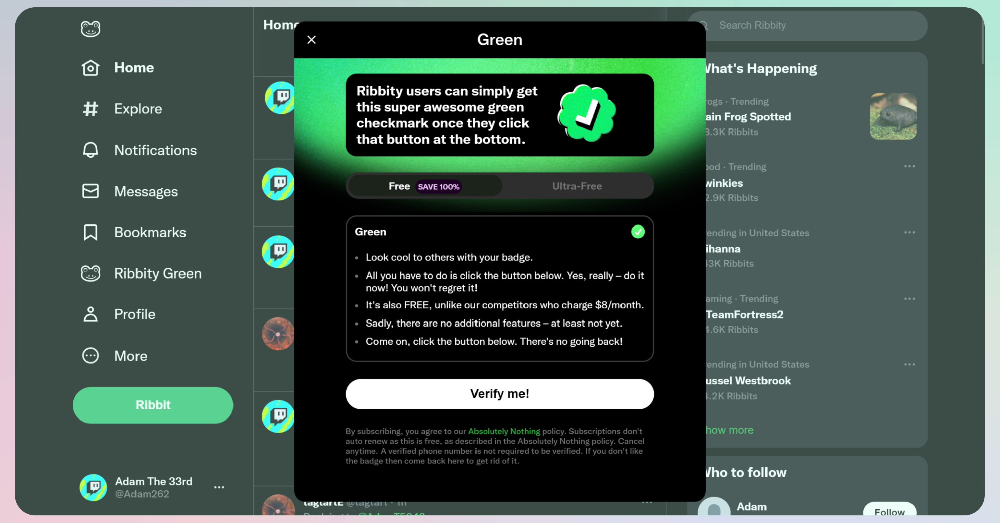

<h1 align="center"> 🐸 Ribbity (Twitter Clone) </h1>


<p align='center'>A twitter inspired clone built using React</p>

## Project Structure

- `frontend/` contains the existing React app and Firebase configuration. Run frontend npm and Firebase commands from this directory.
- `backend/` contains the standalone Express API. It is intentionally separate from the frontend and does not use npm workspaces.

## Local Development

Install each app once, then start both from the repository root:

```bash
npm --prefix frontend install
npm --prefix backend install
npm run dev
```

The frontend runs at `http://localhost:3011` and the backend runs at `http://localhost:3012`.

The backend uses Prisma with PostgreSQL. Set `DATABASE_URL` in `backend/.env` before running Prisma migration, Studio, or database-backed API commands; `backend/.env.example` documents the expected format.

Deploy the frontend to Firebase Hosting from the repository root:

```bash
npm run deploy:frontend
```

## Short Description

Introducing Ribbity, a full stack Twitter-inspired project built with TypeScript, React, Firebase, and Vanilla CSS. Designed to be fully responsive on all devices and accessible, Ribbity offers a slgith alternate design with various unique features. Users can create accounts, customize profiles, and engage with others by creating, liking, sharing, and replying to Ribbits (tweets). Obtain a free green checkmark through the Ribbity Green tab as well. [Additional features below](https://github.com/tagtart1/ribbity/#features-)

## 🔴 Demo

[Live Demo](https://tweety-3dd86.web.app/) available. Click 'Live Demo' to view it.

Demo Account for full access: <br />
Email: demo@gmail.com <br />
Password: Demo123@

## Showcase 🌟

Below is a collection of images and GIFs of user interaction on the site. Users initially begin on just the Explore panel where they are prompted to create an account. After doing so they can now interact with other users, customize their profile, or post their own ribbits. There are minor descriptions below each image to detail what they show.


<p align='center'><sup>Displaying the multiple designs of the site at varying device widths for responsiveness</sup></p>


<p align='center'><sup>Home panel under the 'For you' section displays a chronological list of all Ribbits</sup></p>


<p align='center'><sup>Showing the reply section of a Ribbit on the left and then a reply thread on the right while also on different mobile resolutions</sup></p>


<p align='center'><sup>The UI popups from left to right on making an account after a non-signed in user attempts to like a post</sup></p>


<p align='center'><sup>Mobile main navigation and following/follower panels</sup></p>


<p align='center'><sup>The UI when the user is not signed in</sup></p>


<p align='center'><sup>A User creating and then deleting a Ribbit</sup></p>


<p align='center'><sup>404 Page route</sup></p>


<p align='center'><sup>Ribbity Green popup</sup></p>

## Features ✅

- Responsive Design
- Identical UI/UX design of Twitter with slight personal adjustments
- Create and delete ribbits (tweets) with text, media or both
- Reribbit posts (retweet)
- Like OR dislike Ribbits (tweets)
- Start nesting threads by replying to any ribbit
- Create accounts via email/password or sign in with Google
- Customize your name, bio, location, and profile images
- Follow other users
- Have a green verified checkmark next to your name which can be seen by all users
- Be reccommended other users
- See what posts you or others have posted, replied to, and liked
- Find other user's posts through the explore or home panels
- Toast Notifications on important actions
- Semantic HTML

## Tech Stack ⚗️

- React
- Firebase Firestore
- Firebase Storage
- Typescript
- React Router DOM
- Framer Motion
- Git
- Vanilla CSS

## What I Learned 📖

- Organizing and managing a larger codebase for efficiency and scalability
- Developing a full stack app with Firebase to store complex data and to display that data correctly
- Being able to replicate a complex design such as Twitter and to experiment on it

## Motive

I wanted to build this project to showcase my abilities of React and Typescript by creating a full stack project. While I am not 'developing' the back end, I wanted to show that I have the ability to connect the front-end and back-end technologies together to create a functional app. Futhermore, I wanted to show I can create, manage and understand large codebases like this on my own. In the future, I strive to learn how to develop my own backend and collaborate with others on project while also using SCSS/SASS. Upon completing this project I can now visualize how large professional websites and applications were developed behind the scenes which gives me confidence to continue developing professional websites solo or on a team.

## Credits

[Twitter.com](https://twitter.com): The UI/UX and features of my projectare heavily inspired by Twitter. This is a close built for educational purposes only

I am not in any way connect to Twitter and neither is this project. If you are an owner any copyrighted material used, please let me know!
